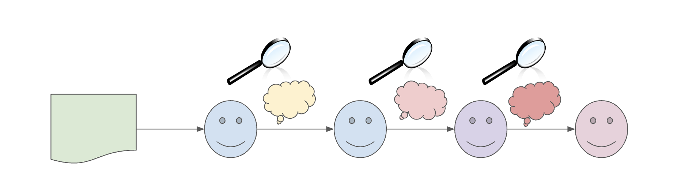

# LLM Transmission Chains

This repository aims to reproduce the findings of [Acerbi et al. (2023) "Large language models show human-like content biases in transmission chain experiments"](https://www.pnas.org/doi/10.1073/pnas.2313790120).

## Preamble
Humans often alter information slightly as it is passed from one person to another—for example, compressing a long story into a shorter version. In this process, certain elements are retained while others are omitted. A key question arises: what type of information is preserved, and what is discarded? For instance, it has been observed that humans tend to prioritize social information (e.g., relationships between individuals) over non-social information (e.g., a town’s weather conditions) during summarization tasks. Understanding these "information preferences" is crucial in the study of cultural evolution, which examines social changes through mechanisms analogous to those of genetic evolution.

A common methodology for studying these preferences is through "transmission chains" or "telephone game", where information is sequentially summarized and passed from one individual to another. Each summary is analyzed to determine which types of information are retained. Various experiments have explored biases toward different kinds of information, such as negative news, gossip, rumors, and threats. Numerous content biases like these have been documented and are discussed in detail in [Stubbersfield (2022) "Content biases in three phases of cultural transmission: A review"](https://akjournals.com/view/journals/2055/19/1/article-p41.xml)



## Mechanics of Telephone Game
Each past experiment typically follows this structure:

1. An initial information (e.g., a story, product review, etc.) is crafted, containing nearly equal representations of various content types.
2. This information is broken down into atomic pieces, each tagged under specific categories.
3. Summaries are then mapped back to these atomic pieces for analysis.

## About Acerbi et al. 2023
The authors explore information preferences in LLMs, investigating whether LLMs exhibit similar biases to humans or if they appear impartial to content type. The authors employ a telephone game with LLMs to replicate prior human-based experiments.

## Respository Organization
The code in this repository is structured as follows:

1. **node.Node**: Initiates a node responsible for querying LLMs and evaluating their outputs.
2. **utils.setup_transmission_chain**: Sets up the transmission chain.
3. **openai_model**: Defines classes for querying LLM APIs.
4. **prompt_generator.py**: Contains classes with prompts tailored to specific tasks.
5. **tasks.py**: Defines complete tasks, including querying APIs and processing outputs.
   
Results are reproduced in the Jupyter notebooks found in the `notebooks` folder, with each plot from the main paper recreated in separate notebooks titled `studyX.ipynb`.


## Tutorial Guide

Each notebook includes three sections:

1. **Authors' Results**: Reproduces the paper's findings using Python (originally conducted in R).
2. **Authors' Summaries / GPT-4 Evaluation**: Evaluates summaries from the original study using GPT-4.
3. **New Summaries / GPT-4 Evaluation**: Uses new summaries from updated experiments and evaluates them using GPT-4.

Thus, these sections takes you from understanding the experimental setup proposed by authors and their way of evaluating the results to running the fresh experiment with the updated LLMs. 

## Setup instructions

**Preferred Environment**: A Conda environment with Jupyter.

```bash
conda env create --name chains python=3.9
conda actvivate chains
conda install jupyter
conda install -c anaconda ipykernel
python -m ipykernel install --user --name=chains
```

**Required libraries**
```
pip install pandas matplotlib python-docx rpy2 openai
```

**Environment Variables:**
Set these environment variables for the Conda environment.

```
AZURE_OPENAI_API_KEY=<YOUR KEY>
AZURE_OPENAI_API_URL=<API URL>
OPENAI_API_VERSION=<API VERSION>
```

Alternatively, use Conda to set the environment variables for this environment only:
```
conda env config vars set AZURE_OPENAI_API_KEY=<YOUR KEY>
conda env config vars set AZURE_OPENAI_API_URL=<API URL>
conda env config vars set OPENAI_API_VERSION=<VERSION>
```

Deactivate and reactivate the environment for these variables to take effect:
```
conda deactivate
conda activate chains  
```

## Data Availability

Data from the authors is available in the OSF [https://osf.io/6v2ps](https://osf.io/6v2ps) and has been included in this repository under the study-data folder. 
The `stories` folder contains the original narratives used in the experiments.

Additional Folders:

1. **analysis**: Contains scripts for generating plots and running LMER analysis.
2. **coding**: Holds results from the authors' manual coding of summaries.
3. **output**: Stores summaries produced by LLMs during the experiment.
4. **pre-reg**: Contains pre-registration documents detailing the experimental designs and analyses, which are typically used for journal pre-evaluation.

--

*Credits: GPT-4 for "Proofread and correct"*